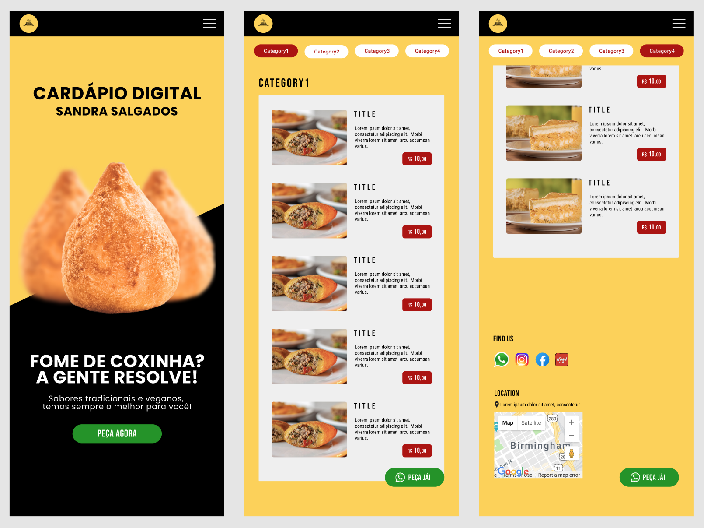

# Restaurant Digital Menu



## Introduction
This project is a generic implementation of a menu that can be used to display a list of products a restaurant offers. It provides generic descriptions of the products, which can be modified and extended as needed. This project was specifically created for **Sandra Salgados**, a small family-owned business in Brazil specializing in Brazilian pastries. Only placeholder images and descriptions are made public to protect the privacy and security of the business.

## Technologies and Tools
- **Design & Prototype:** Figma, Canva.
- **Frontend:** HTML5, CSS3, Vanilla JavaScript, Bootstrap.
- **Deployment & Hosting:** Netlify.

## Features
- **Navigation Menu:** A navigation bar with categories of products. Clicking on a category filters and displays the products within that category.
- **All Products View:** Users can view all products by selecting the "All" category.
- **Product Details:** Each product includes a title, an image, a description, and a price.

## Future Goals
This project currently provides a basic implementation of a restaurant menu. Future enhancements could include:
- **Advanced Frontend Technologies:** Migrating to frameworks like React or Next.js for a more dynamic and responsive user experience.
- **Image Zoom:** Implementing a feature to zoom in on product images.
- **Shopping Cart:** Adding a shopping cart feature to allow users to select multiple items.
- **Payment Integration:** Including payment methods for online ordering.

## Getting Started
To use this menu for your own project, follow these steps:

1. **Clone the Repository:**
```bash
git clone https://github.com/your-username/restaurant-menu.git
```
2. **Navigate to the Project Directory:**
```bash
cd restaurant-menu
```
3. **Open the Project:**
Open the index.html file in your web browser to view the menu.

Feel free to modify and extend the project to suit your needs!

## Get in Touch
If you find this project useful or have suggestions for improvements, please reach out or submit a pull request. Thank you for visiting!


